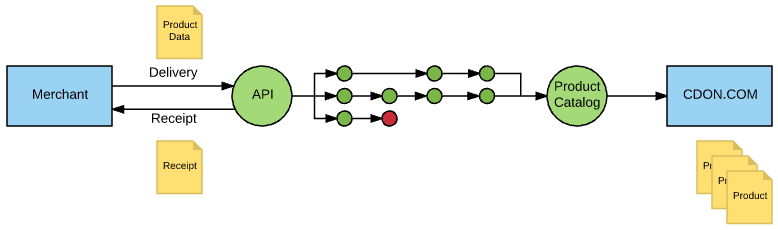

# Introduction

By exporting your inventory to CDON Marketplace, your products will be added to the CDON product catalog, which makes them available to CDON's customers.

In the CDON Marketplace import process, there are two vital key concepts; **data types** and **receipts**. Data is accepted in different types to populate a product with necessary information, whereas the receipt is used to track the progress of the import. The diagram below illustrates the main concept of a delivery.

Deliveries containing multiple products are split up into individual products, which are imported independently from each other. An inventory import is therefore "greedy", which means that any and all products that **can** be imported **will** be imported.

Products that fail validation are naturally not imported, but will not abort the entire delivery. Only products whose content has changed (since the last import) will be updated - unmodified data will be discarded early in the process.