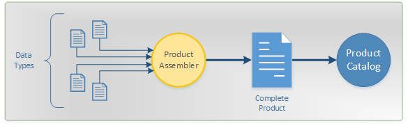

.. include:: ../toc_default.txt

Data Types
##########

In order to present a complete and buyable product to CDON's customers, four distinct types of data are required:

* :doc:`Product Description <api/product>`
* :doc:`Price <api/price>`
* :doc:`Availability <api/availability>`
* :doc:`Media <api/media>`

These four types of data are fully independent from each other in the context of importing the data. In most cases, they also have different life cycles. Depending on your business, some data is shorter lived and require more frequent updates than other data. This enables a more flexible delivery with faster imports.

Although the data is separate from each other, *Product Description*, *Price* and *Availability* are constituents necessary to form a complete product. If any of those three types is missing, the product will be **unavailable** until all product data requirements have been met. When all data is available, it will be compiled into a final product.

*Media* is not necessary to complete a product.

Data Contract
=============

To facilitate a structured delivery of data, each set of data must fulfill a **data contract** that specify the structure of the data, expected data types and mandatory fields. If this contract is not met, the import process is unable to accept the data.

The contracts are made publicly available at this location:

https://schemas.cdon.com/product/4.0/

These contracts can with advantage be used as an acceptance test on the delivery before transmitting it to CDON Marketplace.

.. IMPORTANT::
	Not all business rules are enforced by the contract.
	As the contract is primarily a data interchange format, higher order business rules are not validated until processing begins.
