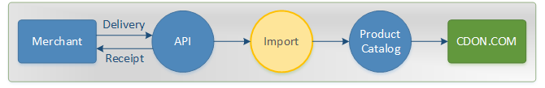

# Overview

By exporting your inventory to CDON Marketplace, your products will be added to the CDON product catalog, which makes them available to CDON's customers.

In the CDON Marketplace import process, there are two vital key concepts; **data types** and **receipts**. Data is accepted in different [types](data-types.md) to populate a product with necessary information, whereas the [receipt](receipts.md) is used to track the progress of the import. The diagram below illustrates the main concept of a delivery.

The different [data types](data-types.md) are imported separately. When all data is available, the final product is assembled and added to the product catalog.

Deliveries containing multiple products are split up into individual products, which in turn are imported independently from each other. An inventory import is therefore "greedy", which means that any and all products that **can** be imported **will** be imported.

The import process is a series of steps that data is passed through. During this process, the data may be validated and modified according to the current business rules.

Products that fail validation are naturally not imported, but will not abort the entire delivery. Only products whose content has changed (since the last import) will be updated - unmodified data will be discarded early in the process.

## Support

CDON Marketplace has its own customer service that gladly helps you with Marketplace related cases.

When contacting support, please provide the following information, if available:

* Merchant ID
* Receipt ID (see [receipts](receipts.md))
* Tracking ID (see [tracking](tracking.md))
* Tracking Code (see [tracking](tracking.md))

Those details will help giving a more accurate diagnosis with technical matters.