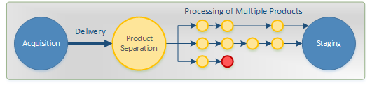

.. include:: ../toc_default.txt
.. include:: <isopub.txt>

Overview
########

By exporting your inventory to CDON Marketplace, your products will be added to the CDON product catalog, which makes them available to CDON's customers.

In the CDON Marketplace import process, there are two vital key concepts; **data types** and **receipts**. Deliveries are made by posting different :doc:`types of data <data-types>`, which populate a product with all necessary information. The :doc:`receipt <receipts>` is used to keep track on the progress of the import.

.. image:: overview.png
	:alt: Conceptual Overview

Each delivery is imported independently. When data of all types is available, the final product is assembled and added to the product catalog for presentation.

.. image:: assembly.png
	:alt: Data Assembly

The Import Process
==================

Data in a delivery is passed through a series of sequential steps which make out the import process. During this process, the data is validated and may be modified according to the current business rules.

.. image:: process.png
	:alt: Import Process

Deliveries containing multiple products are split up into individual products, which in turn are imported independently from each other.

Products that fail validation are naturally not imported, but will not abort the entire delivery. Only products whose content has changed (since the last import) will be updated |mdash| unmodified data will be discarded early in the process.

.. caution::
	An inventory import is **greedy**, which means that any and all products that **can** be imported **will** be imported.

Support
=======

CDON Marketplace has its own customer service that gladly helps you with Marketplace related cases.

When contacting support, please provide the following information when available:

* Merchant ID
* Receipt ID (see :doc:`receipts <receipts>`)
* Tracking ID (see :doc:`tracking <tracking/index>`)
* Tracking Code (see :doc:`tracking <tracking/index>`)

Those details will help giving a more accurate diagnosis with technical matters.
