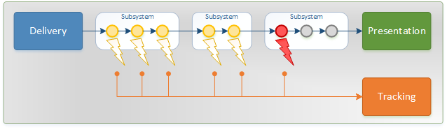

.. include:: ../../toc_default.txt

Tracking
########

.. include:: toc_tracking.txt

Products in any delivery are processed individually as they journey through the import process. As the product passes certain milestones during the import, an entry is recorded in what is called the "tracking API". As the name suggests, these entries can be used to track the progress of the import (and individual products).

The :doc:`receipt <../receipts>` that is given when a delivery has been accepted is the key to retrieve status of the import, but also to examine what events have passed for each product. By using the tracking API, detailed information is provided to e.g. why a product has not been successfully imported.

The base URL to the tracking-API is::

	https://productimport.cdon.com/import/<query>

where `<query>` is :doc:`status <importstatus>`, :doc:`summary <importsummary>` or :doc:`details <productdetails>`.
